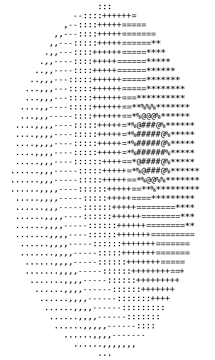
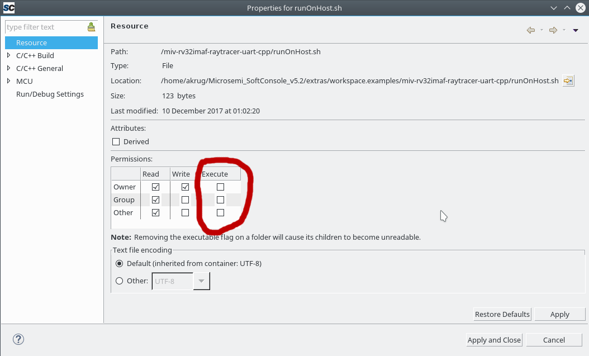
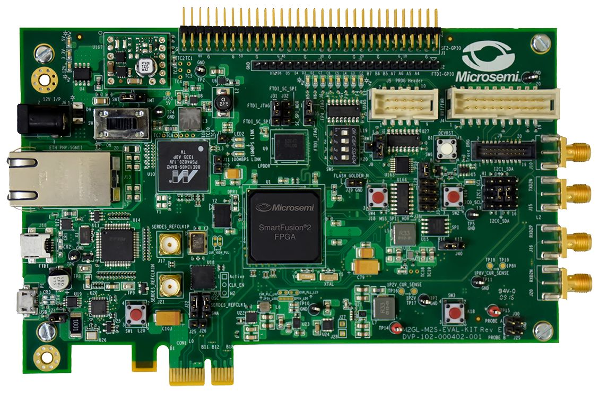

# Simple ASCII Raytracer

This SoftConsole C++ example project demonstrates how to use floating point arithmetic on a Mi-V Soft processor running at **50MHz**.  



# Mi-V Soft processor
This example uses a Mi-V Soft processor MiV_RV32IMAF_L1_AHB. The design is built for debugging MiV_RV32IMAF_L1_AHB through the SmartFusion2 FPGA programming JTAG port using a FlashPro5. 

All the platform/design specific definitions such as peripheral base addresses, system clock frequency (preconfigured for 50MHz) etc. are included in hw_platform.h. The hw_platform.h is located at the **src** folder of this project.

The MiV_RV32IMAF_L1_AHB firmware projects need the riscv_hal and the hal firmware (RISC-V HAL).

The RISC-V HAL is available through Firmware catalog as well as [from the GitHub repository](https://github.com/RISCV-on-Microsemi-FPGA/riscv-hal):

https://github.com/RISCV-on-Microsemi-FPGA/riscv-hal

# How to use this example
This example project requires USB-UART interface to be connected to a host PC. The project is not using anything else than UART, no other internal/external peripheral is required. It's using default settings at 115200 baud rate. By default it's using 80x40 terminal. On Windows The host PC must connect to the serial port using a terminal emulator such as HyperTerminal or PuTTY configured as follows:
* 115200 baud
* 8 data bits
* 1 stop bit
* no parity
* no flow control

Linux users could use:
```bash
screen /dev/ttyUSB0 115200
``` 
Or any equivalent serial terminal application (e.g. minicom). For more help see:

https://wiki.archlinux.org/index.php/working_with_the_serial_console

Project has enabled the C++ Compiler Preprocessor defines and using the **SERIAL_TERMINAL_ANIMATION** to use the [VT100 control escape sequences](http://www.termsys.demon.co.uk/vtansi.htm) to move cursor and turn the output into pseudo "animation". If the terminal is not supporting the control escape sequences then it might display strangely rendered symbols on the first line. If this is not desired, removing the define from the project settings will disable this "animation" feature.

Project settings have predefined **MSCC_STDIO_THRU_CORE_UART_APB** so all regular printf calls should be redirected to UART. This allows the code be generic enough to run on x86 **Linux** host. A script **runOnLinuxHost.sh** script and **Raytracer-on-Linux-host** launcher are made for this purpose.

The launcher should be visible from external tools. If it's not, then it might be required to disable **Filter Configuration Types** filter first. If this project was cloned from the GitHub repository it might have default file permission on the script and then the launcher will fail, the permissions can be changed within the SoftConsole with a right click on the script and clicking Properties.



The program is called withing few loops so the sphere will be "rendered" under different "zoom" levels and under different lighting conditions. All the output can be observed only through UART (not GPIO LEDs or anything else present).

**Note:** The **SERIAL_TERMINAL_ANIMATION** is in the  **C++** Compiler Preprocessor defines while the **MSCC_STDIO_THRU_CORE_UART_APB** is in the  **C** Compiler Preprocessor defines.

# Features
* Using C++ (templates, classes, inheritance, overloading arithmetic/casting operators, private fields with public methods etc...)
* Small source codebase, single file ~200 lines long.
* Phong shading (ambient + diffuse + specular)
* Using 11 shades of ASCII
* Perspective aware projection
* Multitarget, thanks to MSCC_STDIO_THRU_CORE_UART_APB it runs on x86/amd64 Linux and on RV32IMAF cores without any sourcecode change.

# C++
Even this project is using C++, it still might not be the right language for other embedded applications. In C++ it's easier to write code which will be resources heavy. Features such as RTTI are consuming a significant amount of memory. Exception handling might impact runtime performance. Overall caucious approach should be taken when using C++ for an embedded target and researching/testing how each feature will impact the target. More information:

https://electronics.stackexchange.com/questions/3027/is-c-suitable-for-embedded-systems

https://stratifylabs.co/embedded%20design%20tips/2017/09/15/Tips-Understanding-Memory-using-Embedded-C++/

http://bitbashing.io/embedded-cpp.html


# Math and C++ resources
Links which might be useful:

https://www.ics.uci.edu/~gopi/CS211B/RayTracing%20tutorial.pdf

https://tmcw.github.io/literate-raytracer/

http://www.3dcpptutorials.sk/index.php?id=16

http://mathforum.org/mathimages/index.php/Ray_Tracing

https://math.stackexchange.com/questions/13261/how-to-get-a-reflection-vector

https://youtu.be/KDHuWxy53uM

https://en.wikipedia.org/wiki/Phong_reflection_model

http://en.cppreference.com/w/c/numeric/math

http://en.cppreference.com/w/cpp/language/operators

http://en.cppreference.com/w/cpp/language/cast_operator

http://en.cppreference.com/w/cpp/language/explicit

https://coderwall.com/p/nb9ngq/better-getting-array-size-in-c

https://stackoverflow.com/questions/926752/why-should-i-prefer-to-use-member-initialization-list

# Target hardware
This example project is targeted at a SmartFusion2 M2S090 Security Eval Kit design which has CoreUART enabled. The example project is built using a clock frequency of 50MHz. Trying to execute this example project on a different design will result in incorrect baud rate being used by CoreUART.



This example project can be used with another design using a different clock configuration. This can be achieved by overwriting the content of this example project's "hw_platform.h" file with the correct data from your Libero design.

The release mode configuration for this example project uses microsemi-riscv-ram.ld 
linker script. This Linker script is specific for the SmartFusion2 target. It creates the executable image for the SRAM memory area. 

An example design for SmartFusion2 90 Security Eval Kit is available at:

https://github.com/RISCV-on-Microsemi-FPGA/M2S090-Security-Eval-Kit

# Silicon revision dependencies
This example is tested on M2S090 device.